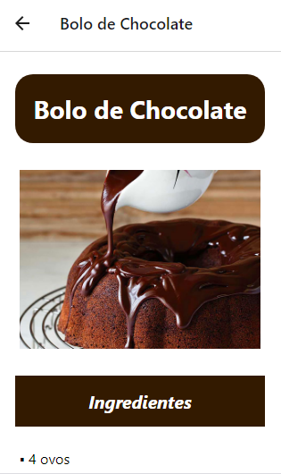
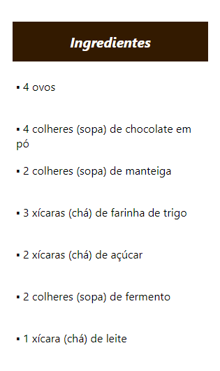
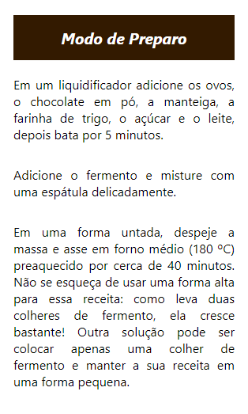
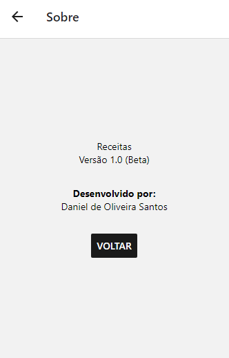

# App de Receitas
Pequeno projeto criado utilizando React Native. Um aplicativo de receitas com interface simples e de fácil manuseio. O usuário terá opções na tela inicial e poderá escolher a receita que deseja fazer tocando no ícone do alimento. Após selecionar, a receita inteira será mostrada na tela.

## Confira

### Home

	

### Tela de Receita

	
	
	

### Tela de Sobre

	

